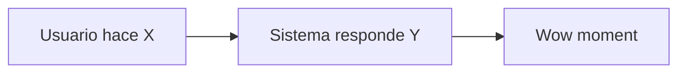
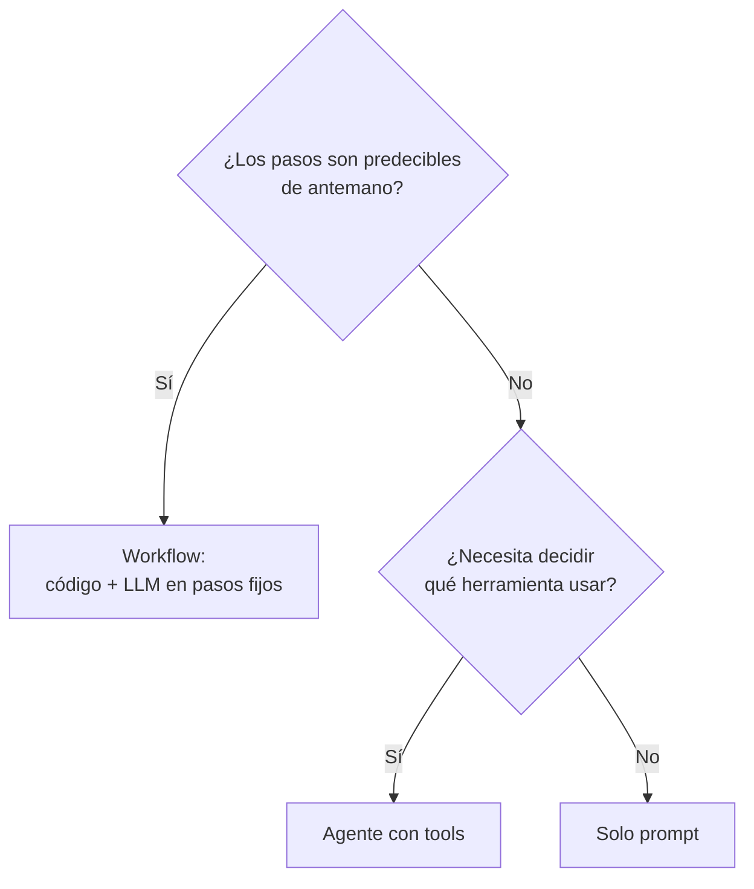

# Cómo construir un producto de IA Generativa en menos de 48 horas

**Desafío IA Bagó Perú 2026** · Moshe Ojeda · 12 jun 2026

  <a href="https://github.com/moshe-exe/desafio-ia-bago-peru-2026" target="_blank" class="slidev-icon-btn">
    <carbon:logo-github />
  </a>

---
layout: image-right
image: https://avatars.githubusercontent.com/u/moshe-exe
---

# Quién soy

**Moshe Ojeda**

- Co-founder en **Agentman** — agentes de IA para retail y healthcare
- Antes: **Yape** (producto), **Rappi** (growth + producto)
- 10+ años construyendo software en entornos de alto impacto
- Hoy: agentes que reemplazan flujos enteros, no botones

  Hablo desde el "lo he hecho, me ha salido mal, lo volvería a hacer".

---
layout: center
class: text-center
---

# La pregunta

## ¿Se puede construir un producto de IA en 48 horas?

<v-click>

### Sí. Pero "producto" no significa lo que crees.

</v-click>

---

# Lo que NO es construir un producto en 48h

- ❌ Un MVP listo para producción
- ❌ Algo escalable a 10k usuarios
- ❌ Algo con auth, billing, observability, tests, etc.
- ❌ "El próximo Notion + IA"

<v-click>

### Lo que **sí** es:

- ✅ **Una demo end-to-end** que un usuario real pueda tocar
- ✅ **Un slice vertical** que prueba la hipótesis central
- ✅ **Una historia** que se cuenta en 5 minutos y se entiende

</v-click>

---
layout: section
---

# Mapa del talk

1. **El método** — cómo organizar las 48h
2. **La arquitectura** — qué construir
3. **Los errores** — qué evitar

---
layout: section
---

# Parte 1 — El método

---

# La regla #1: recorta hasta que duela

> Si después de recortar el scope no sientes que perdiste algo importante, **no recortaste lo suficiente**.

<v-click>

### El antipatrón:

"Vamos a hacer una plataforma que..."

### El patrón:

"Vamos a hacer **una sola cosa**: que el usuario pueda *[acción concreta]* y reciba *[resultado concreto]*."

</v-click>

---

# Las 48 horas en 4 bloques

| Bloque | Horas | Objetivo |
|--------|-------|----------|
| **0. Diseño** | 0 – 6h | Definir la **demo killer**: una sola interacción que vende la idea |
| **1. Slice vertical** | 6 – 24h | End-to-end **feo pero funcional**. Sin pulir. |
| **2. Datos reales + iteración** | 24 – 40h | Cambiar mocks por datos reales. Pulir prompts. |
| **3. Story + deploy** | 40 – 48h | Pulir flujo de demo, desplegar, ensayar pitch |

<v-click>

  Si en la hora 24 no tienes algo que corra end-to-end, <strong>cambia de problema</strong>.

</v-click>

---

# La regla del "demo path"

Una **sola línea recta** desde input → output. Sin bifurcaciones.

<v-click>

### Lo que **no** está en el demo path:
- Auth real → hardcode un usuario
- Onboarding → entra directo al wow moment
- Settings, perfil, historial → no existen
- Manejo de errores → "happy path" o nada

</v-click>

---
layout: two-cols
---

# Hardcode estratégico

**Hardcodea lo que no aporta a la demo.**

- IDs de usuario
- Datos de entrada de ejemplo
- Resultados intermedios "no-IA"
- Configuración

::right::

**Construye de verdad lo que vende la idea.**

- La interacción central con el modelo
- El prompt + tools + memoria
- El output que el jurado va a ver
- El flujo que cuentas en el pitch

  El jurado no le da puntos a tu sistema de auth.

---
layout: section
---

# Parte 2 — La arquitectura

---

# Stack mínimo Gen AI · 2026

| Capa | Opción rápida | Opción "Azure Foundry" |
|------|---------------|------------------------|
| **Frontend** | Streamlit / Next.js | Next.js en Azure Static Web Apps |
| **Backend** | FastAPI / Express | FastAPI en Azure Container Apps |
| **LLM** | gpt-4o / Claude / Llama | Modelos en Azure AI Foundry |
| **Memoria/RAG** | SQLite + embeddings | Azure AI Search |
| **Almacenamiento** | archivos locales | Azure Blob / Cosmos DB |
| **Deploy** | Vercel + Render | Azure Container Apps |

<v-click>

  <strong>Regla:</strong> elige el stack que ya conoces. El hackatón no es para aprender Kubernetes.

</v-click>

---

# Agentes vs. workflows

<v-click>

### En hackatón: **empieza por workflow**.

Solo pasa a agente cuando el workflow ya no te alcanza. La mayoría de demos ganadoras son workflows bien empaquetados.

</v-click>

---

# La caja de un agente · 4 componentes

### 🧠 Prompt
- System prompt (rol, restricciones)
- Few-shot (2-3 ejemplos)
- Reglas de salida (formato)

### 🔧 Tools
- Funciones Python/TS expuestas
- Schema claro (JSON)
- Idempotentes si es posible

### 💾 Memoria
- Chat history (corto plazo)
- Scratchpad (estado de la tarea)
- RAG (conocimiento externo)

### 🔁 Loop
- Cuándo parar
- Max iteraciones
- Condición de éxito

---

# Azure AI Foundry · dónde encaja cada cosa

| Componente | En Foundry |
|------------|------------|
| Modelos (GPT-4o, o3, Llama) | **Foundry Models** |
| Function calling / tools | **Foundry Agents** + tool definitions |
| RAG sobre tus datos | **Azure AI Search** + indexers |
| Evaluación de prompts | **Foundry evaluations** |
| Deploy del agente | **Foundry endpoints** + Container Apps |
| Observabilidad | **App Insights** + Foundry traces |

<v-click>

  No tienes que usar <em>todo</em>. Para una demo: <strong>Models</strong> + 1-2 <strong>tools</strong> + <strong>AI Search</strong> si necesitas RAG. Listo.

</v-click>

---
layout: section
---

# Parte 3 — Los errores

---

# Top 5 errores en hackatones de IA

1. **Construir features en lugar de la demo.** 
   Cada feature que no se demuestra es horas perdidas.

2. **Sobre-ingeniería del prompt.** 
   300 líneas de system prompt = el modelo te ignora la mitad.

3. **RAG cuando no se necesita.** 
   ¿Cabe el contexto en la ventana? Mete todo y ya.

4. **Múltiples agentes cuando uno basta.** 
   "Orchestrator + 3 sub-agentes" = 4x debugging, 4x latencia.

5. **Dejar el deploy para el final.** 
   Despliega en la hora 6, no en la hora 47.

---

# Lo que SÍ ayuda

- 👤 **Una sola persona dueña de la demo.** Decide qué entra y qué no.
- 🎭 **Mock primero, datos reales después.** Construye el flujo con datos fake.
- 🌳 **Trunk-based dev.** No hagas PRs entre ustedes. Commit directo a `main`.
- 📹 **Graba la demo en la hora 40.** Si el sistema falla en vivo, tienes el video.
- ⏱️ **Ensaya el pitch en voz alta.** 3 veces mínimo. El tiempo importa.

---
layout: center
class: text-center
---

# Las 3 reglas que te van a salvar

1. **Recorta el scope hasta que duela.**
2. **Construye el demo path, no el producto.**
3. **Despliega en la hora 6, no en la 47.**

---
layout: center
class: text-center
---

# Recursos

- [Slidev — slides as code](https://sli.dev/)
- [Azure AI Foundry docs](https://learn.microsoft.com/azure/ai-foundry/)
- [Anthropic — building effective agents](https://www.anthropic.com/research/building-effective-agents)
- [OpenAI — prompt engineering guide](https://platform.openai.com/docs/guides/prompt-engineering)

---
layout: center
class: text-center
---

# Gracias

## ¿Preguntas?

[github.com/moshe-exe](https://github.com/moshe-exe) · Agentman

